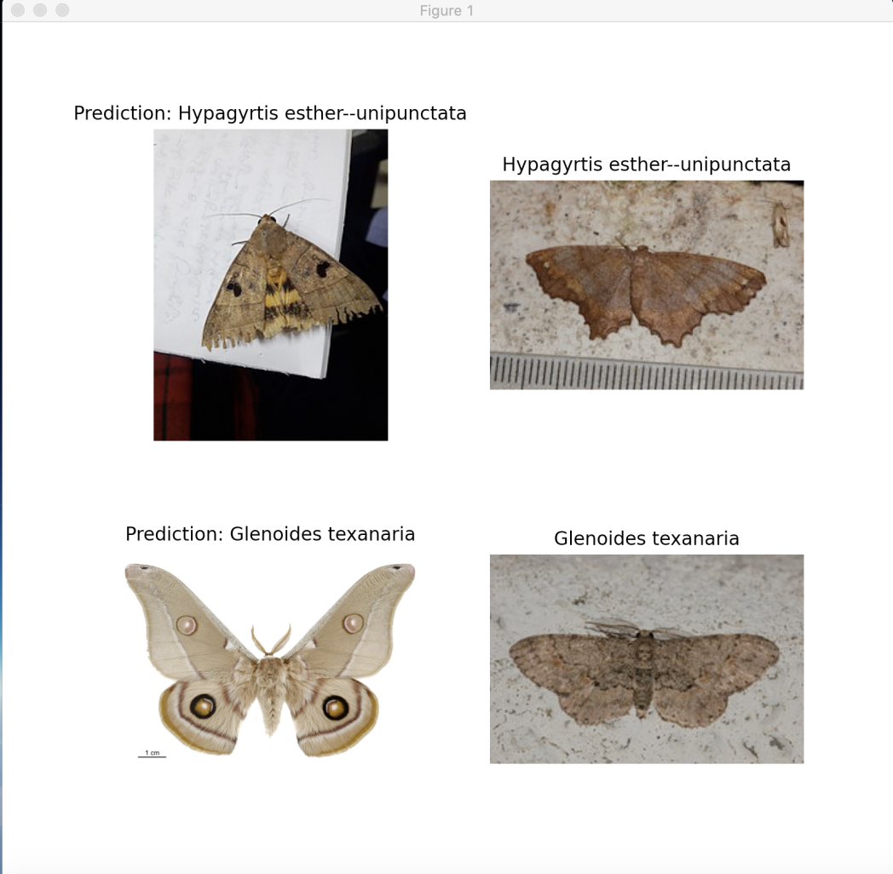

# Machine Learning Module 
### Main Dev: Ben Giangrasso

## Frameworks and Tools:
    - Python
    - Tensorflow
    - Redis

## Important Machine Learning Files
* mmodel.py
    * Creates an image classification machine learning model object
    * Requirements to create machine learning model object:
      * URL to the download of the dataset (compressed in a .zip)
      * Number of image classes
    * *init()*
      * Initializes new machine learning model with 80-20 validation split
      * Model must be given a name, type, dataset URL, and a number of image classes
      * Unpacks .zip file and saves the dataset locally 
        * Command to locate dataset directory
        ```
        cd ~/.keras/moth_images/images
        ```
    * *train()* 
      * Must be called before saving or testing a new model created with the *init()* function
      * Automatically saves model as a .h5 file after completion
    * *load()*
      * Loads a saved .h5 machine learning model into the machine learning model object
    * *test()*
      * Classifies the input image with the selected model
      * Requires URL or file path to an image
      * Outputs classification and confidence rating
    * *test_zip()*
      * Tests model against a .zip file of multiple images
      * Returns a side-by-side diagram:
      
* utils.py
    * Downloads the dataset located at url and extracts it to the specified directory specific to the Moth Classifier API
    * Contains *filter_dataset()* function that allows sub-datasets to be created
        * This function also sorts the dataset by size 
        * The sorted dataset is limited to a specified number of folders.
* api_handler.py
    * Listens and carries out jobs sent by the API through the Redis server
    * Selects a specific machine learning model to carry out the job
    * Returns classification and confidence rating to the API

    
